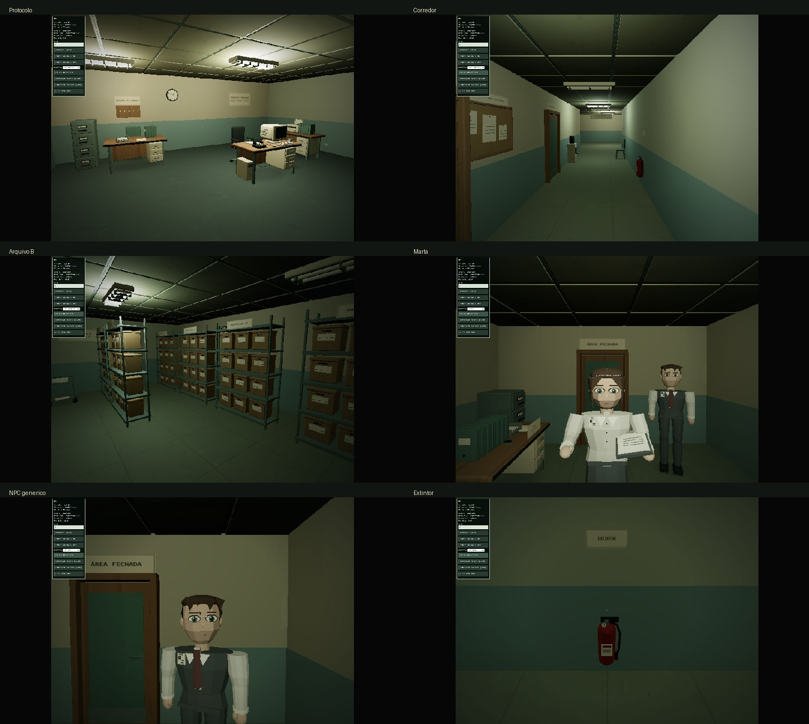

# DISORDER — Art Vertical Slice / Blender Pass

30/09/2026. Gameplay aprovado pelo autor preservado; nenhuma tarefa, anomalia, setor, final ou sistema narrativo novo. Render continua 640×480, 4:3, upscale pixelado. Este relatório substitui o checkpoint visual histórico de `PIVOT_REPORT.md`.

## 1–6. Estado inicial, referências e personagens

1. Encontrado: cômodos com grandes vazios, NPCs estreitos/tubulares, rostos pequenos, pasta flutuante, piso fotográfico e props com poucos sinais de fabricação. Build inicial passou; cena atual foi aberta no navegador antes da edição.
2. Substituídos os quatro GLBs ativos, as oito texturas de superfície e o kit de props. Não houve reescrita dos sistemas de movimento, seed, save, tarefa, interação ou narrativa. Apenas integração visual de NPCs, materiais, iluminação e posições DEV de inspeção.
3. `models/image/individual`: `boss.png`, `colega_feminina.png`, `main_character.png`, `zelador.png`.
4. `models/image/group`: `npc (1).png`, `npc (2).png`, `npc (3).png`, `npc (4).png`, `npc (5).png`. Cada arquivo é um NPC distinto.
5. Remodelados: Marta, colega da abertura/supervisor, office_01 e office_02. Cabeças maiores, olhos grandes, mãos simplificadas, sapatos de bico quadrado, roupas/cabelos derivados das respectivas referências. Colega tem risca lateral, terno e gravata; Marta tem cabelo preso, blusa clara, saia e crachá; genéricos têm cardigan e colete distintos. Os cinco assets preparados anteriormente não foram remodelados nesta etapa.
6. Referências usadas: os quatro arquivos correspondentes, as três capturas antigas enviadas pelo autor e a direção de estilo descrita no pedido. Originais não foram movidos, renomeados, editados ou apagados. Prévia Blender é inspeção de asset, não prova de render in-game.

## 7–12. Fontes, geometria e animações

7. Fontes editáveis atualizadas: `source-assets/blender/characters/important/{marta,supervisor}.blend`, `characters/generic/{office_01,office_02}.blend` e `office-kit.blend`. Novas fontes focadas: `props/{extinguisher,key_board,noticeboard,archive_cart}.blend`, `environment/ceiling_panel.blend`. Atlas PNG de origem em `environment/props-atlas.png`; imagem também empacotada nas fontes do kit.
8. Runtime: `public/assets/models/office-kit.glb`, `characters/important/{marta,supervisor}.glb`, `characters/generic/{office_01,office_02}.glb`. Os manifestos registram contagens reproduzíveis. GLB do kit agrega 41 templates; a antiga Marta sem rig está retida por compatibilidade histórica, mas não é instanciada.
9. Triângulos por personagem remodelado:

| Personagem | Triângulos | Ossos |
| --- | ---: | ---: |
| Marta | 6.172 | 16 |
| Colega / supervisor | 5.388 | 16 |
| office_01 | 6.128 | 16 |
| office_02 | 5.352 | 16 |

10. Refinados: mesa, cadeiras, CRT, gabinete, teclado, telefone, impressora, armário, estante, caixa, fichário, bebedouro, porta e luminária. Extintor remodelado com ombros/base, válvula, alavancas, manômetro, pino, mangueira, bocal, suporte e etiqueta. Novos: quadro de avisos, quadro de chaves, bandeja de papéis, grampeador, moldura pessoal, cabos, interruptor, tomada, acabamento de teto, carrinho de arquivo e luminária apagada. Extintor 2.712 tris; quadro de chaves 3.228; carrinho 1.744. Prioridade de silhueta, não limites rígidos.
11. Dez clips por ator: idle, walk, talk, look, sit, stand, typing, work_at_desk, carry_folder, inspect_document. Respiração/transferência de peso, gesto de fala, caminhada e trabalho de mãos. Pranchetas agora seguem a mão via skinning. Fala/idle/walk/inspeção/look usados no fluxo atual; sentar/digitar/trabalhar estão preparados, não foram inventadas novas atividades. Animações procedurais simples, não mocap.
12. Rig compartilhado: hips, spine, neck, head, arm/forearm/hand L/R, thigh/shin/foot L/R. Atualização 24 Hz até 20 m. Giro sutil da cabeça para jogador próximo. Iris separado permite roxo por material, sem duplicar a personagem. Material `badge` separado prepara substituição do crachá; roupa permanece em materiais próprios.

## 13–19. Texturas, materiais e ambientes

13. Dez WebPs originais procedurais: wall-a/b, wood, painted-metal, paper, carpet, ceiling, linoleum, props-atlas, contact-shadow. Nada de fotografia amostrada.
14. 64 px: metal, papel, teto e sombra; 128 px: paredes, madeira, carpete e vinílico; atlas de props 256×256. Etiquetas administrativas continuam CanvasTexture. Todas as superfícies WebP são lossless e têm teste automatizado de formato/dimensão.
15. MeshStandardMaterial simples, atlas compartilhado `OfficeAtlas`, arquitetura separada para variações de parede, tubos emissivos e MeshBasicMaterial transparente para contato. Nearest na ampliação, nearest mip sampling; orientação do atlas substituto corrigida (`flipY=false`) para acompanhar UVs glTF. Sem novos shaders pesados, pós-processamento ou dependências de runtime.
16. Seis point lights sem shadow maps + hemisphere. Segundo ponto quente no Protocolo; ponto administrativo deslocado à frente de Marta; arquivo com menos intensidade; uma lâmpada de corredor e uma do arquivo apagadas. Sombras de contato discretas sob móveis e NPCs, sem custo de dezenas de luzes com sombras.
17. Protocolo: bancada secundária de organização, bandejas, fichários, cabos, grampeador, moldura pessoal, tomadas, quadro de chaves real, quadro de avisos e melhor luz. Posições/interações de CRT, telefone e impressora preservadas. Circulação principal permanece livre.
18. Arquivo B: oito estantes, duas filas adicionais no lado oeste, mais caixas, carrinho e fichários; teto escuro/luminária desligada contrastam com Protocolo. A prateleira três, códigos e posições das três caixas continuam iguais. Percurso automatizado de ida e volta passou.
19. Corredor/administração: avisos modelados, extintor detalhado, interruptor/tomada, acabamento de teto, porta com placa inferior e ferragens; bancada de Marta organizada. Edifício continua funcional e barato, não uma ruína.

## 20–27. Verificação e publicação

20. Vistas estáveis locais observadas próximas de 165 FPS / 6,1 ms nesta máquina. Transições/compilação inicial não são benchmark. Não foi testado um computador modesto; metas 60/30 FPS não são garantidas para todo hardware.
21. Nas capturas finais locais: 12–38 draw calls. Durante outros enquadramentos da revisão houve até 77; variar enquadramento e NPCs visíveis altera o número. Material compartilhado reduz calls de props; não há LOD complexo.
22. Capturas locais renderizadas: 181.436–194.708 tris. Inventário automatizado final: 221.716 tris, 96 objetos mesh (não é contagem visível nem draw calls).
23. Build estático: 10.053.729 bytes / 34 arquivos (~10,05 MB decimal). Inclui cinco GLBs antigos preparados, não carregados pelo runtime. Nenhum .blend/reference/source é copiado para dist.
24. `npm run build`: passou, sem warnings de Vite. `npm test`: 21/21, incluindo rota, colisões, interação, save, seed, áudio, dimensões WebP, escala humana e movimento real de clips. Blender exportou e salvou os fontes; avisos de acesso a preferências/miniaturas de usuário não impediram geração, testes ou carregamento.
25. Commits: pendentes de registro final.
26. GitHub Actions: pendente de publicação/verificação.
27. URL pública a verificar após deploy: https://gustvxlz.github.io/disorder/. Build local de produção revisada em http://127.0.0.1:4173/, separada da sessão de jogo do autor. Workflow de deploy não modificado.

## 28–30. Limitações e próxima rodada

28. Não se afirma playthrough humano contínuo completo nesta rodada: mecânicas foram aprovadas pelo autor, regressão de percurso usa física/raycast reais; inspeção de arte usa posições DEV. Áudio foi preservado e carregamento será conferido; qualidade percebida requer audição humana. Fontes animadas têm pesos predominantemente rígidos por segmento; podem apresentar vincos fortes em poses extremas. Sem facial/lip sync, campanha ou finais novos.
29. Nenhum boneco humano antigo permanece colocado. Templates/atores antigos não usados continuam preservados. Paredes modulares e alguns props secundários mantêm construção simples; não se afirma arte final de todos os assets. Rótulos distantes continuam pouco legíveis a 640×480.
30. Próximo Art Pass: aprovação do autor sobre proporções/rostos, refinamento de deformação de ombros/saia e UVs próprios de roupa, depois adaptação dos NPCs restantes. Só expandir arte após esta avaliação; não expandir gameplay automaticamente.

## Capturas

Capturas reais da build local de produção, sem retoque da arte. A aprovação artística final pertence ao autor; passagem de build não equivale a aprovação visual.

- [Protocolo](source-assets/art-review/screenshots/protocol.jpg)
- [Corredor](source-assets/art-review/screenshots/corridor.jpg)
- [Arquivo B](source-assets/art-review/screenshots/archive.jpg)
- [Marta](source-assets/art-review/screenshots/marta.jpg)
- [NPC genérico](source-assets/art-review/screenshots/generic-npc.jpg)
- [Extintor](source-assets/art-review/screenshots/extinguisher.jpg)
- [Colega na abertura](source-assets/art-review/screenshots/opening-colleague.jpg)
